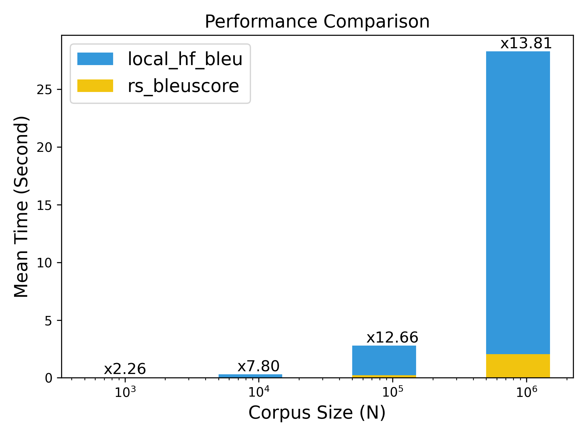

# bleuscore

[](https://codecov.io/gh/shenxiangzhuang/bleuscore)
[](./LICENSE)
[](https://crates.io/crates/bleuscore)
[](https://pypi.org/project/bleuscore/)


[`bleuscore`](https://github.com/shenxiangzhuang/bleuscore)
is a fast BLEU score calculator written in rust.

## Installation
The python package has been published to [pypi](https://pypi.org/project/bleuscore/),
so we can install it directly with many ways: 

- `pip`
    ```bash
    pip install bleuscore
    ```

- `poetry`
    ```bash
    poetry add bleuscore
    ```

- `uv`
    ```bash
    uv pip install bleuscore
    ```

## Quick Start
The usage is exactly same with [huggingface evaluate](https://huggingface.co/spaces/evaluate-metric/bleu):

```diff
- import evaluate
+ import bleuscore

predictions = ["hello there general kenobi", "foo bar foobar"]
references = [
    ["hello there general kenobi", "hello there !"],
    ["foo bar foobar"]
]

- bleu = evaluate.load("bleu")
- results = bleu.compute(predictions=predictions, references=references)
+ results = bleuscore.compute(predictions=predictions, references=references)

print(results)
# {'bleu': 1.0, 'precisions': [1.0, 1.0, 1.0, 1.0], 'brevity_penalty': 1.0, 
# 'length_ratio': 1.1666666666666667, 'translation_length': 7, 'reference_length': 6}

```

## Benchmark

**TLDR: We got more than 10x speedup when the corpus size beyond 100K**

<p align="center">
  
</p>

We use the demo data shown in quick start to do this simple benchmark.
You can check the [benchmark/simple](./benchmark/simple) for the benchmark source code.

- `rs_bleuscore`: bleuscore python library
- `local_hf_bleu`: huggingface evaluate bleu algorithm in **local**
- `sacre_bleu`: sacrebleu
  - Note that we got different result with sacrebleu in the simple demo data and all the rests have same result
- `hf_evaluate`: huggingface evaluate bleu algorithm with **evaluate** package


The `N` is used to enlarge the predictions/references size by simply duplication the demo data as shown before.
We can see that as `N` increase, the bleuscore gets better performance.
You can navigate [benchmark](./benchmark/README.md) for more benchmark details.


### N=100

```bash
hyhyperfine --warmup 5 --runs 10   \
  "python simple/rs_bleuscore.py 100" \
  "python simple/local_hf_bleu.py 100" \
  "python simple/sacre_bleu.py 100"   \
  "python simple/hf_evaluate.py 100"

Benchmark 1: python simple/rs_bleuscore.py 100
  Time (mean ± σ):      19.0 ms ±   2.6 ms    [User: 17.8 ms, System: 5.3 ms]
  Range (min … max):    14.8 ms …  23.2 ms    10 runs

Benchmark 2: python simple/local_hf_bleu.py 100
  Time (mean ± σ):      21.5 ms ±   2.2 ms    [User: 19.0 ms, System: 2.5 ms]
  Range (min … max):    16.8 ms …  24.1 ms    10 runs

Benchmark 3: python simple/sacre_bleu.py 100
  Time (mean ± σ):      45.9 ms ±   2.2 ms    [User: 38.7 ms, System: 7.1 ms]
  Range (min … max):    43.5 ms …  50.9 ms    10 runs

Benchmark 4: python simple/hf_evaluate.py 100
  Time (mean ± σ):      4.504 s ±  0.429 s    [User: 0.762 s, System: 0.823 s]
  Range (min … max):    4.163 s …  5.446 s    10 runs

Summary
  python simple/rs_bleuscore.py 100 ran
    1.13 ± 0.20 times faster than python simple/local_hf_bleu.py 100
    2.42 ± 0.35 times faster than python simple/sacre_bleu.py 100
  237.68 ± 39.88 times faster than python simple/hf_evaluate.py 100
```

### N = 1K ~ 1M

| Command                                  |       Mean [ms] | Min [ms] | Max [ms] |        Relative |
|:-----------------------------------------|----------------:|---------:|---------:|----------------:|
| `python simple/rs_bleuscore.py 1000`     |      20.3 ± 1.3 |     18.2 |     21.4 |            1.00 |
| `python simple/local_hf_bleu.py 1000`    |      45.8 ± 1.2 |     44.2 |     47.5 |     2.26 ± 0.16 |
| `python simple/rs_bleuscore.py 10000`    |      37.8 ± 1.5 |     35.9 |     39.5 |     1.87 ± 0.14 |
| `python simple/local_hf_bleu.py 10000`   |     295.0 ± 5.9 |    288.6 |    304.2 |    14.55 ± 0.98 |
| `python simple/rs_bleuscore.py 100000`   |     219.6 ± 3.3 |    215.3 |    224.0 |    10.83 ± 0.72 |
| `python simple/local_hf_bleu.py 100000`  |   2781.4 ± 42.2 |   2723.1 |   2833.0 |   137.13 ± 9.10 |
| `python simple/rs_bleuscore.py 1000000`  |   2048.8 ± 31.4 |   2013.2 |   2090.3 |   101.01 ± 6.71 |
| `python simple/local_hf_bleu.py 1000000` | 28285.3 ± 100.9 |  28182.1 |  28396.1 | 1394.51 ± 90.21 |


