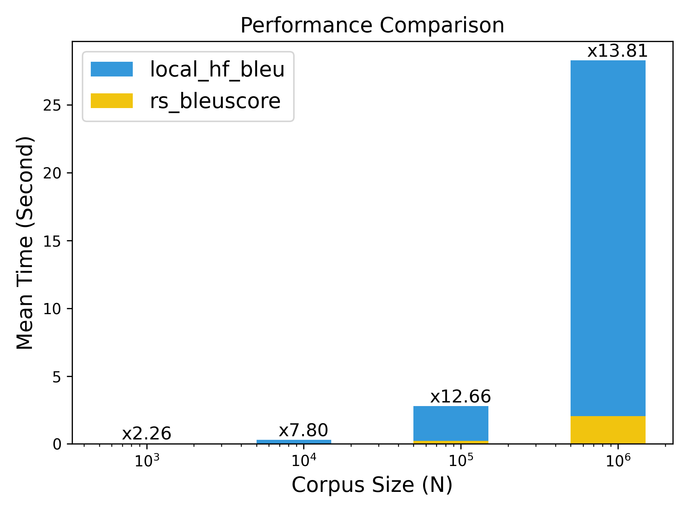

# bleuscore

[](https://crates.io/crates/bleuscore)
[](https://pypi.org/project/bleuscore/)
[](https://www.npmjs.com/package/bleuscore-js)
[](https://docs.rs/bleuscore/0.1.3/bleuscore/)
[](https://codecov.io/gh/shenxiangzhuang/bleuscore)
[](./LICENSE)
[](https://codspeed.io/shenxiangzhuang/bleuscore)

[`bleuscore`](https://github.com/shenxiangzhuang/bleuscore)
is a fast BLEU score calculator written in rust. You can check try the web demo [here](https://datahonor.com/bleuscore/) for a quick experience.


## Installation
The python package has been published to [pypi](https://pypi.org/project/bleuscore/),
so we can install it directly with many ways: 

- `uv`
    ```bash
    uv add bleuscore
    ```

- `pip`
    ```bash
    pip install bleuscore
    ```

## Quick Start
The usage is exactly same with [huggingface evaluate](https://huggingface.co/spaces/evaluate-metric/bleu):

```diff
- import evaluate
+ import bleuscore

predictions = ["hello there general kenobi", "foo bar foobar"]
references = [
    ["hello there general kenobi", "hello there !"],
    ["foo bar foobar"]
]

- bleu = evaluate.load("bleu")
- results = bleu.compute(predictions=predictions, references=references)
+ results = bleuscore.compute(predictions=predictions, references=references)

print(results)
# {'bleu': 1.0, 'precisions': [1.0, 1.0, 1.0, 1.0], 'brevity_penalty': 1.0, 
# 'length_ratio': 1.1666666666666667, 'translation_length': 7, 'reference_length': 6}

```

## Benchmark

**TLDR: We got more than 10x speedup when the corpus size beyond 100K**

<p align="center">
  
</p>

We use the demo data shown in quick start to do this simple benchmark.
You can check the [benchmark/simple](./benchmark/simple) for the benchmark source code.
Detailed per-PR results are tracked automatically via the [Benchmark workflow](.github/workflows/benchmark.yml).


