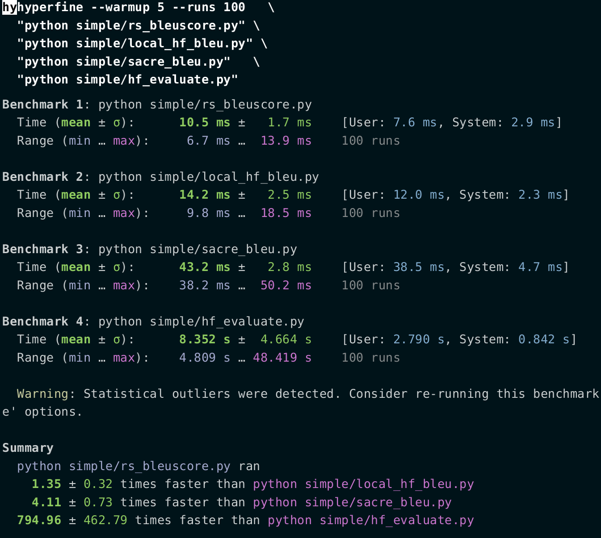

# bleuscore

[](https://codecov.io/gh/shenxiangzhuang/bleuscore)
[](./LICENSE)
[](https://crates.io/crates/bleuscore)
[](https://pypi.org/project/bleuscore/)


[`bleuscore`](https://github.com/shenxiangzhuang/bleuscore)
is a fast(not yet :) BLEU score calculator written in rust.

## Installation
The python package has been published to [pypi](https://pypi.org/project/bleuscore/),
so we can install it directly with many ways: 

- `pip`
    ```bash
    pip install bleuscore
    ```

- `poetry`
    ```bash
    poetry add bleuscore
    ```

- `uv`
    ```bash
    uv pip install bleuscore
    ```

## Quick Start
The usage is exactly same with [huggingface evaluate](https://huggingface.co/spaces/evaluate-metric/bleu):

```diff
- import evaluate
+ import bleuscore

predictions = ["hello there general kenobi", "foo bar foobar"]
references = [
    ["hello there general kenobi", "hello there !"],
    ["foo bar foobar"]
]

- bleu = evaluate.load("bleu")
- results = bleu.compute(predictions=predictions, references=references)
+ results = bleuscore.compute(predictions=predictions, references=references)

print(results)
# {'bleu': 1.0, 'precisions': [1.0, 1.0, 1.0, 1.0], 'brevity_penalty': 1.0, 
# 'length_ratio': 1.1666666666666667, 'translation_length': 7, 'reference_length': 6}

```

## Benchmark
We use the demo data shown in quick start to do this simple benchmark.
You can check the [benchmark/simple](./benchmark/simple) for the benchmark source code.

- Benchmark1: bleuscore
- Benchmark2: huggingface evaluate bleu algorithm in **local**
- Benchmark3: sacrebleu
  - Note that we got different result with sacrebleu in the simple demo data and all the rests have same result
- Benchmark4: huggingface evaluate bleu algorithm with **evaluate** package


The `N` is used to enlarge the predictions/references size by simply duplication the demo data as shown before.

We can see that as `N` increase, the bleuscore gets better performance.

### N=1

<div style="text-align: center;">
    
</div>

### N=100
We will only test the bleuscore and evaluate **local** results from here, 
because the other two methods are too slow to test quickly.

<div style="text-align: center;">
    
</div>

### N=10,000

<div style="text-align: center;">
    
</div>

### N=100,000

<div style="text-align: center;">
    
</div>


